

<b>시스템 분석설계 1주차 </b>

<b>저작권 안내</b>

> 이 강의 교안은 한국공학대학교 경영학부 강송희 교수의 저작물로,   저작권법의 보호를 받습니다.
무단 전재와 복제를 삼가주시기 바랍니다.

Educational/Non-commercial CC BY-NC

<b>오리엔테이션</b> 
<b>Orientation</b>

# 강송희 교수 소개

  

## 학력 및 경력
- 한국공학대학교 경영학부 조교수 (현재)
금융산업표준개발 기술위원회 기술분과 위원
한국소프트웨어기술인협회 이사

- 소프트웨어정책연구소(SPRi) 선임연구원 (8년)
- 산업계 경력: 오라클, 삼성전자, 현대자동차 등 (7년+)
- 서울대학교 연수연구원 및 강사, 경희대학교 객원교수 겸임 (1.5년)

## 연구 및 전문 분야
- 경영정보시스템, 계산사회과학
- AI 기반 결정 시스템 연구
- 플랫폼 비즈니스와 생태계 전략
- 디지털 전환과 혁신 연구
- 지속가능한 개발
- 복잡계와 정책 의사결정 연구

> "디지털 기술과 알고리즘이 리스크 인식과 대응 방식을 어떻게 변화시키는가?"

 

<h1><b>연구실 소개</b></h1>

 
<b>AX-ID 연구실은 디지털 혁신과 의사결정 시스템 연구를 통해 복잡한 사회문제 해결을 목표로 합니다.(Opening: ~2명)</b>   

    AX, Computational Innovation & Design  
    <b>AX-ID랩</b>   
    책임: 강송희 교수(한국공학대학교)  
    Engineering tomorrow where technology serves people> 

    

  

# 진로의 다양성과 가능성

하나의 길만이 정답은 아닙니다. 다양한 경로를 통해 자신만의 독특한 커리어를 만들어갈 수 있습니다.

| 산업계 | 연구소 | 학계 |
|---|---|---|
| **오라클, 삼성전자, 현대자동차** (실무 경험 7년+)  - 비즈니스 문제 해결 역량 강화 - 기술과 시장의 접점 경험 - 실무 중심의 응용 능력 개발 - 다양한 프로젝트 경험 축적 | **소프트웨어정책연구소** 선임연구원 (8년)  - 심층 연구 및 정책 개발 - 학술적 전문성 심화 - 장기적 관점의 문제 해결 - 국가 정책 수립에 기여 | **한국공학대학교** 경영학부 조교수  - 연구와 교육의 균형 - 차세대 인재 양성 - 지식 창출 및 확산 - 학문적 네트워크 구축 |

> "진로는 미리 그려진 지도가 아니라, 여러분이 직접 개척해나가는 여정입니다. 다양한 경험을 두려워하지 마세요. 각각의 경험에 여러분만의 독특한 전문성을 만들어갑니다."

 

# 경영정보학이란?

경영학, 경영정보학, 소프트웨어공학의 관계와 차이점 이해하기

|  구분 | 경영학 | 경영정보학 | 소프트웨어공학  |
| --- | --- | --- | --- |
|  학문적 초점 | 기업 경영일반 전 영역을 포괄적으로 다룸 | 경영학 이론과 IT기술을 결합하여 기업 경영활동에 IT기술을 어떻게 활용할 것인가에 초점 | 컴퓨팅 기술 자체의 근본 원리와 구현 방법, 개발 공정의 관점(애자일 등)  |
|  관심영역 | 조직이론, 마케팅, 재무, 인사, 조직행동, 경영전략 등 | 조직내 정보의 흐름, 데이터 관리와 분석, 시스템 설계 및 운영, 디지털 기술의 도입 및 활용, IT 기술 혁신 | 알고리즘, 프로그래밍 언어, 운영체제, 네트워크, 임베디드 등  |
|  주요과목 | 경영학 원론, 마케팅, 재무관리, 회계학, 인사관리, 조직행동론, 전략경영, 기업윤리, 국제경영 | 데이터 베이스, 시스템분석설계, 프로그래밍, ERP, IT인프라 | 소프트웨어개발, 시스템분석설계, 컴퓨터 구조, 네트워크, 임베디드  |
|  학습방법 | 이론중심 | 이론 + 실습 | 이론 기반의 수학적 접근  |
|  졸업 후 진로 | 경영 전반 | IT컨설팅, 데이터 분석가, 시스템 기획개발, 금융 제조 유통 스타트업 등 다양한 산업에서 IT기반 의사결정 역할 수행 | 시스템 엔지니어, 보안전문가  |

  

# 8. 경영정보학 과목 개요

- 조직의 비즈니스 기능들을 수행하는 정보시스템을 구축하고 유지 관리하는 방법
- 주요 목적은 주요한 비즈니스 업무들에 대해 소프트웨어 솔루션을 적용함으로써 직원들의 업무 효율성을 높이는 것
- 성과를 얻기 위해서는 구조적인 접근을 해야 함
- 경영정보의 코어 과목
    - 데이터베이스 (설계, 구현, 관리, 활용)
    - 프로그래밍
    - 시스템 분석 및 설계
    - 프로젝트 관리
    - 정보시스템 관리
    - 기업시스템

  

<b>과목 개요</b> 
<b>Course Overview</b>

# 과목 일반사항

|  구분 | 내용  |
| --- | --- |
|  수업방법 | 문제중심학습/프로젝트중심학습 (Problem-Based Learning / Project-Based Learning)  |
|  수업언어 | 한국어  |
|  세부운영내용 | • 문제해결형 팀 프로젝트 기반 실습과 모범사례 연구
|| • 시스템 요구 분석 및 설계 능력 함양
||• 조직의 비즈니스 요구사항을 효과적으로 수집하고 분석할 수 있다
||• SDLC 단계별 절차와 핵심 산출물을 이해하고 설명할 수 있다
||• Use Case, DFD, ERD, UML 등 다양한 시스템 모델링 도구를 활용하여 분석 및 설계를 수행할 수 있다
||• 실제 조직 문제 해결을 위한 정보시스템 설계 프로젝트를 팀 기반으로 수행할 수 있다
||• 개발자와 사용자 간 커뮤니케이션을 위한 설계 문서를 작성하고 발표할 수 있다  |

PBL 학습 효과

|  협업 능력 향상 | 문제 해결 역량 강화 | 실무 적용 경험 | 의사소통 기술 개발  |
| --- | --- | --- | --- |
 
# 성적 평가 기준

제32조 및 학칙시행세칙 제51조에 의거하여 평가하며, 각 항목별 루브릭(평가기준표)은 별도 안내 예정

|  평가항목 | 비율 (%) | 세부내용  |
| --- | --- | --- |
|  출석 | 10% | 출석 및 수업태도  |
|  중간고사 | 20% | 5지선다 객관식  |
|  기말고사 | 20% | 5지선다 객관식  |
|  과제 | 20% | 루브릭 기반 미니 텀프로젝트 과제  |
|  발표 | 10% | 루브릭 기반 발표평가  |
|  토론 | 20% | 루브릭 기반 미니 텀프로젝트 과제 토론  |

※ 학칙 제32조 및 학칙시행세칙 제51조에 의거하여 평가하며, 각 항목별 루브릭(평가기준표)은 별도 안내 예정
  
# 15주차 커리큘럼 전체 개요

1-2주차
 - 강의 소개, 팀 구성, 시스템분석설계 소개, 관련 문서 유형 및 특징

3-4주차
 - 구조적 분석 방법론, 객체지향분석/설계 기법 소개, UML 개요 및 기초 다이어그램 학습

5-7주차
 - 시스템 개발 절차, 분석단계 개요, Case Tool 소개, 요구사항 정의(유스케이스 모델, 명세, 이벤트 흐름 모델)

8주차
 - 중간고사 - 5지선다 객관식 (20%)

9-11주차
 - 통합 분석/설계 방법론, 요구사항 사례연구, 정부RFP, 기능점수 관련, 데이터모형 구축 방법

12-14주차
 - 텀 프로젝트 중간발표, 객체지향 방법론 사례, 분석/설계 단계 결과물 중심 최종발표

15주차
 - 기말고사 - 5지선다 객관식 (20%)

# 주차별 학습 일정 개요

|  주차 | 주요 학습 내용 | 세부 내용  |
| --- | --- | --- |
|  1주차 | 강의 소개, 팀 구성 |   |
|  2주차 | 시스템 분석/설계 방법론 |   |
|  3주차 | 구조적 분석 방법론 |   |
|  4주차 | 프로젝트 관리 개론 |   |
|  5주차 | 시스템 계획 및 선정 |   |
|  6주차 | 시스템 요구사항 조사 |   |
|  7주차 | 시스템 요구사항 구조화 1 |   |
|  8주차 | 중간고사 | 5자선다 객관식 (20%)  |
|  9주차 | 시스템 요구사항 구조화 2 |   |
|  10주차 | 시스템 요구사항 구조화 3 |   |
|  11주차 | 데이터베이스 설계 |   |
|  12주차 | 팀 프로젝트 중간발표 |   |
|  13주차 | 시스템 구현 및 운영 |   |
|  14주차 | 팀 프로젝트 최종발표 |   |
|  15주차 | 기말고사 | 5자선다 객관식 (20%)
※ 월(이론, 사례 강의), 화(팀 활동 및 실습, 문제풀이)  |

 

# 수업 방식 및 실습 프레임

|  월요일 | 화요일  |
| --- | --- |
|  이론 강의 | 팀 활동  |
|  사례 분석 | 실습 과제  |
|  개념 정립 | 문제 풀이  |

 

# 학기가 끝나면 우리는 어떤 사람이 되어있는가

## 시스템 사고와 분석력
복잡한 비즈니스 프로세스와 정보 시스템의 구조를 논리적으로 분석하고, 문제의 본질을 파악할 수 있습니다.

## 현장 중심 사례 이해
다양한 산업 및 조직의 실제 사례를 바탕으로, 시스템 개선과 설계 방향을 도출할 수 있습니다.

## 문제 해결 및 의사결정 능력
경영 현장에서 발생하는 다양한 문제를 시스템 관점에서 진단하고, 효과적인 개선안 및 IT 솔루션을 제시할 수 있습니다.

## 프로젝트 관리 및 협업 역량
시스템 개발 프로젝트의 기획, 요건 정의, 설계, 검증 등 전체 과정을 단계별로 이해하고, 팀원들과 효과적으로 협업할 수 있습니다.

## 실무형 IT 활용력과 변화 대응력
정보시스템(ERP, CRM 등) 및 최신 IT 도구를 비즈니스 혁신에 적용하는 방법을 익히고, 현장 업무에 실질적으로 활용할 수 있습니다. 디지털 트랜스포메이션, AI, 클라우드 등 빠르게 변화하는 기술 환경에 맞추어, 조직의 변화와 혁신을 주도할 수 있습니다.

여러분은 경영과 IT의 융합형 전문가로서 기업과 사회의 미래를 이끄는 실전 역량을 갖추게 됩니다.

 

# 강의 전반 Q&amp;A

## 1. 팀 프로젝트는 어떻게 구성되나요?
3-4명으로 구성된 팀을 통해 실제 조직의 문제를 분석하고, 정보시스템 설계 프로젝트를 수행합니다. 팀 구성은 1주차에 이루어지며, 다양한 역량이 균형있게 분포되도록 지원합니다.

## 2. 필요한 학습 준비물이 있나요?
노트북 또는 컴퓨터 접근성이 필요합니다. Use Case, DFD, ERD 등 모델링 작업을 위한 도구(Draw.io, Lucidchart, Visual Paradigm 등)를 사용할 수 있는 환경이 필요하며, 관련 소프트웨어는 수업 중에 안내됩니다.

## 3. 참고자료는 어디서 얻을 수 있나요?
강의 LMS 시스템에 주차별 강의자료와 참고문헌이 업로드됩니다. 주 교재는 ‘한빛미디어, 시스템분석 및 설계’이며, 실무 문서 템플릿과 사례 연구 자료도 제공됩니다.

## 4. 선수지식이 필요한가요?
프로그래밍 지식은 필수가 아닙니다. 비즈니스 프로세스를 이해하고 분석하는 능력에 초점을 맞추며, 기초적인 IT 이해도만으로 수강 가능합니다. 다만 프로젝트 진행을 위한 기본적인 협업 태도와 문제해결 의지가 중요합니다.

## 📝 퀴즈

### Q1. 시스템 분석 단계에서 가장 먼저 수행되는 활동은 무엇인가?

- A. 시스템 설계  
- B. 유지 보수  
- C. 요구 사항 분석  
- D. 테스트  
- E. 구현  

---

### Q2. SW 요구사항 중  
**“시스템이 반드시 제공해야 하는 기능, 서비스, 입력/출력”**을 무엇이라고 하는가?

- A. 비기능적 요구  
- B. 구현 요구  
- C. 기능적 요구  
- D. 성능 요구  
- E. 사용자 요구  

---

> 💡 **안내**  
> 위 퀴즈는 이번 강의에서 다룰 주요 개념을 미리 확인하기 위한 문제입니다.  
> 강의를 들으며 정답을 찾아보세요.

 

# 시스템 분석 및 설계 개요_SAD Overview

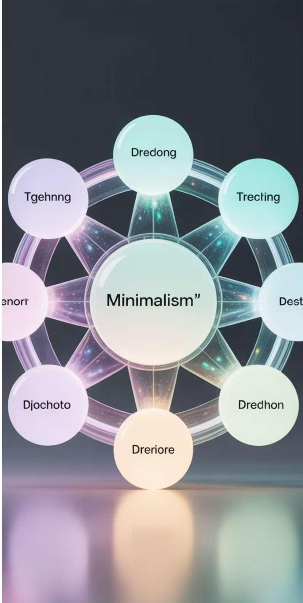

# 메가 트렌드

최근 기술 및 산업을 좌우하는 메가 트렌드 소개

생산성, 경제 성장의 유일한 열쇠

1891

# Paul Krugman

Born: February 28, 1953

## Neo-Keynesian Economist

- 2008 Nobel Prize Recipient in Economic Sciences for his work on New Trade Theory and New Economic Geography
- Prolific columnist for The New York Times
- Played a key role in the resurgence of Keynesian economics in the wake of the Great Recession

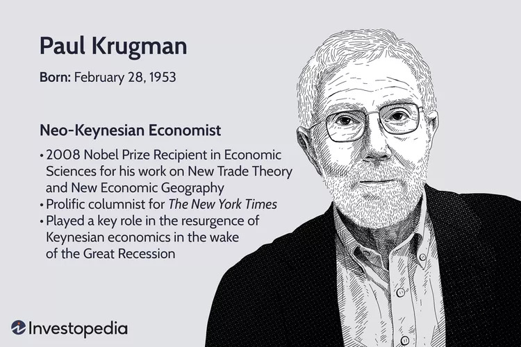

Peddling Prosperity: Economic Sense and Nonsense in the Age of Diminished Expectation. By Paul Krugman. London: Norton. 1994. 303pp.

># "생산성이 전부는 아니지만 장기적으로 보면 거의 전부가 된다" 
> — Paul Krugman

정부와 정책 입안자들은 교육, 연구 개발, 인프라 투자 등 다양한 분야에 집중하여 장기적인 경제 성장을 촉진하고 사회 전반의 번영을 증진하는 데 필수적인 생산성을 향상시켜야 합니다. 한 국가의 생활 수준 향상 능력은 근로자 1인당 생산량을 늘릴 수 있는 능력에 달려 있습니다.

 

# 기술 변곡점의 도래

- 세계경제포럼은 2023년 정례회의에서 생성AI를 게임 체인저로 정의하고, 사회와 산업 차원의 신중한 대비와 논의가 필요하다는 의견을 발표
- 민간 재단이 운영하는 포럼이지만 세계 각국의 정치·경제 지도자 2000명 안팎이 참여해 다양한 주제에 대한 의견과 정보를 교환하고 논의를 하는 모임으로, 세계무역기구 등 국제기구나 세계 경제 활동에 큰 영향

> 자료: World Economic Forum(2023)

  

# AI가 경제를 평균 두배로 성장시킨다

## AI 도입에 따른 생산성 향상

|  AI 도입 기업 | +16%  |
| --- | --- |
|  AI 도입 + 직원교육 | +20%  |
|  글로벌 경제성장률 기여도 | 1.2%p  |

## 경제 파급 효과 (예상)

|  8,500조원 | 460조원  |
| --- | --- |
|  미국 (2035년까지) | 한국 (2030년까지)  |

자료: Accenture(2024), McKinsey Global Institute(2023)

자료 : 김준연(2024) 재인용, https://www.Accenture.com/lv-en/_acnmedia/PDF-33/Accenture-Why-Al-is-the-Future-of-Growth.pdf http://www.mckinsey.com/global-themes/employment-and-growth/technology-jobs-and-the-future-of-work?cid=other-eml-alt-mgi-mgi-oth-1705&amp;hlkid=75769586c86e4a018917487459b7230e&amp;hctky=2630251&amp;hdpid=a09516c8-7f82-472b-aaa9-320f2a194dd22

  

# 퓨처 콘

> # 미래? : 경험하지 못한 세상에 대한 상상
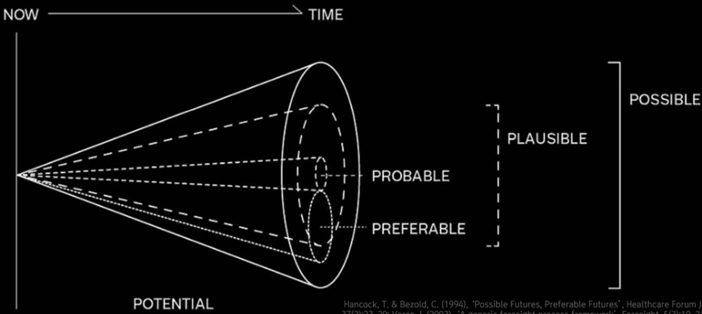

Hancock, T. &amp; Bezold, C. (1994), ‘Possible Futures, Preferable Futures’, Healthcare Forum Journal, 37(2):23-29; Voros, J. (2003), ‘A generic foresight process framework’, Foresight, 5(3):10-21

# 미래 유망 기술: AI 체형도

> # SPRi DaRT 2024 : 디지털 기술의 중-장기 진화 방향의 Keyword
> Dynamic Radar for Trends and signals

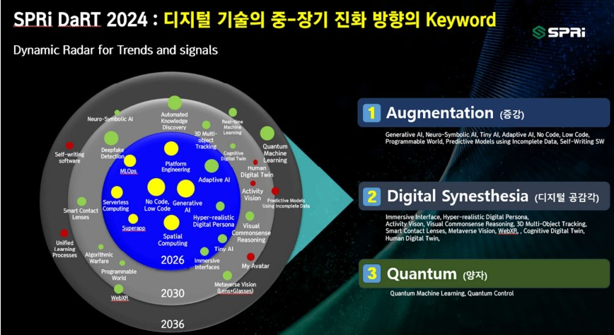

 

# 인공지능 기술의 두 가지 유형

## 예측 AI (Predictive AI)

- 전통적 인공지능 기술로, 데이터 분석과 패턴 인식에 특화
- SNS 알고리즘, 검색 엔진, 언어 모델(LM), 자연어 처리 기술 등에 활용
- 기존 데이터를 기반으로 미래 결과나 추세를 예측
→ 입력: 타블라 데이터, 텍스트, 이미지 등 출력: 예측값, 분류, 확률, 분석 결과

## 생성 AI (Generative AI)

- 학습 세트를 기반으로 새로운 콘텐츠를 창작하는 기술
- 텍스트, 이미지, 오디오, 비디오 등 인간의 창의력과 관련된 콘텐츠 생성
- 기존에 없던 것을 만들거나 유사한 스타일로 변형
→ 입력: 프롬프트, 지시사항, 참조 이미지 등 출력: 텍스트, 이미지, 코드, 음악 등 새로운 콘텐츠

### ☑ 상호 보완적인 기술

  

# 어떤 미래를 준비해야 할까

AI 역량이 미래 고용을 좌우

> # "AI를 잘 활용하는 사람이 그렇지 못한 사람의 일자리를 대체할 것"
> — 리처드 볼드윈 교수, 스위스 제네바 대학교 경제학 교수, 2023년 세계경제포럼

4차 산업혁명 시대에서는 AI 기술 활용 능력이 노동시장의 핵심 역량이 되고 있습니다. 디지털 전환 과정에서 AI 도구를 효과적으로 이해하고 활용할 수 있는 인재가 미래 일자리의 주역이 될 것입니다. 경영·IT 융합 인재로서 AI 기술을 비즈니스에 통합하는 시스템 분석 및 설계 역량이 더욱 중요해지고 있습니다.

  

# 소결 : IT 트렌드와 시스템 분석 및 설계

- 글로벌 IT 트렌드는 “도구” 중심에서 “서비스”와 “플랫폼” 중심으로 이동 중입니다.
- 국내에서는 오랫동안 SI(시스템통합) 산업이 강세였지만,
- AI·클라우드 확산으로 비즈니스가 서비스/구독형(SaaS 등)으로 급격히 전환되는
- 이 전환기에 시스템 분석 및 설계의 중요성이 더욱 커지는 중입니다.

# 경영학도가 시스템분석및 설계 과목, 왜 들어야 하나요?
> ## 근본적인 질문

<b>시스템 분석 및 설계'의 중요성</b> 
<b>비즈니스 혁신과 디지털 전환의 핵심 역량</b>

># Design is a process of making dreams come true.
>John M. Keller(2010)

“설계는 원하는 바를 실제 사실로 만들어가는 과정이다.  
“앞으로는 설계역량과 탐구적 사고를 지닌 인재가 필요하다.

 

# 문제 해결과 가치 창출

## 비즈니스 프로세스 이해 및 개선
현대 기업에서는 업무 흐름을 효율적으로 파악하고, 시스템적으로 문제를 진단·개선하는 능력이 요구됩니다. 이 과목에서 프로세스 분석과 요구사항 정의 방법을 익히면 실무에서 핵심적인 역할을 할 수 있습니다.

## 의사결정 역량 강화
정보시스템이 경영에 미치는 영향, 데이터 기반 의사결정, IT 투자 타당성 분석 등 전략적 판단에 필요한 배경지식을 쌓을 수 있습니다.

## IT 역량의 중요성
디지털 트랜스포메이션, 빅데이터, 자동화 등 모든 경영환경에서 IT의 역할이 증대되고 있습니다. 경영학도에게 요구되는 IT와 비즈니스의 융합 능력을 기르는 데 필수적인 과목입니다.

## 프로젝트 및 팀워크 경험
시스템 분석 및 설계 과정은 실제로 팀 프로젝트를 통해 현장과 유사한 경험을 쌓을 수 있어, 협업과 커뮤니케이션 역량 강화에도 도움이 됩니다.

## 커리어 확장성
경영 컨설팅, IT 기획, ERP, 데이터 분석 등 다양한 분야에서 경영학도의 경쟁력을 높여주는 중요한 기초 지식입니다.

 

# 기술 환경 변화와 비즈니스 요구

## 기술 환경 변화
AI, 클라우드, 데이터 중심 혁신이 시장을 주도하며, 시스템 변화에 따른 요구사항이 급격하게 다양화·복잡화되고 있습니다.

## 사용자 경험 중심
기존 SI처럼 단순 기능 구현이 아니라, 고객 경험·비즈니스 프로세스·지속적 서비스 개선까지 포괄하는 분석·설계가 필수입니다.

## 유연한 대응력
오늘날의 비즈니스 환경에서는 빠른 변화 대응과 지속적인 혁신을 위한 체계적이고 유연한 시스템 설계가 경쟁력의 핵심입니다.

Continuous Improvement

PREST

# 서비스 전환기의 품질·경쟁력 확보

## 지속적 개선과 운영

서비스로 전환되면, 시스템은 '한 번 구축'이 아니라 '지속적으로 개선·운영'되어야 하므로 초기 분석/설계 정확성이 품질과 운영 효율에 직결됩니다.

## 빠른 대응 능력

예측 가능한 운영, 빠른 장애 대응, 신속한 변화 대응도 사전 분석/설계 역량에 달렸습니다.

## 경쟁력의 원천

분석/설계 역량이 서비스의 지속 성장과 시장 경쟁력을 결정하는 핵심 요소로 작용합니다.

# 서비스 기반 혁신 추진

국내 ICT산업은 HW/SI 위주에서 SW/서비스/플랫폼 중심으로 재편 중이며, 이는 기존 산업구조의 한계를 극복하고 글로벌 경쟁력을 확보하는 핵심 전략입니다.

혁신적인 디지털 서비스(AI 기반 솔루션, 클라우드 플랫폼 등)의 성공은 강도 높은 분석과 설계를 바탕으로, 서비스 구조를 유연하게 설계·진화시키는 데서 시작됩니다.

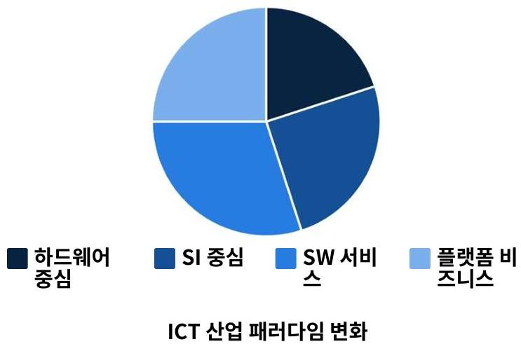

이해관계자·운영환경 다양성 대응

## 다양한 이해관계자
서비스 전환 과정에서는 고객, 운영자, 개발자 등 다양한 이해관계자와 기존 시스템(레거시)·신규 기술(예:AI, 클라우드) 사이의 복잡한 요구와 충돌을 조정해야 합니다.

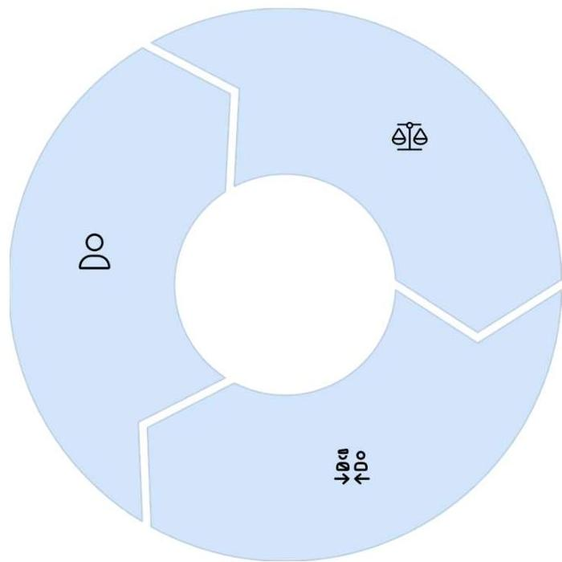

## 관점 통합 능력
이해관계자별 다른 관점과 목표를 통합적으로 관리하는 능력이 시스템 분석가의 핵심 역량으로, 성공적인 프로젝트 완수를 위한 필수 요소입니다.

## 균형점 찾기
효율적·안정적 통합 조정은 시스템 분석 및 설계의 주요 역할로, 운영 환경과 기술적 요구사항의 균형점을 찾는 과정입니다.

# 글로벌 트렌드/규제 환경

## 데이터 보안 및 개인정보 보호
GDPR, CCPA 등 글로벌 데이터 규제 준수는 시스템 분석 단계에서부터 반영되어야 하며, 설계 시 Privacy by Design 원칙 적용이 필수적

## 국제 표준 준수
ISO/IEC 27001(정보보안), ISO 25000(소프트웨어 품질), IEEE/ISO/IEC 등의 시스템 개발 표준과 컴플라이언스는 글로벌 비즈니스의 기본 요구사항

## AI 활용 확대 및 윤리
알고리즘 편향성, 설명 가능한 AI(XAI), 데이터 거버넌스 등 AI 시스템 개발·활용에 대한 윤리적·법적 측면을 시스템 분석·설계 단계에서부터 고려 필요

사전 분석·설계가 명확해야만 빠르고 안전하게 복잡한 환경에 대응할 수 있으며, 급변하는 글로벌 비즈니스와 규제 환경 속에서도 지속가능한 시스템 운영이 가능합니다.

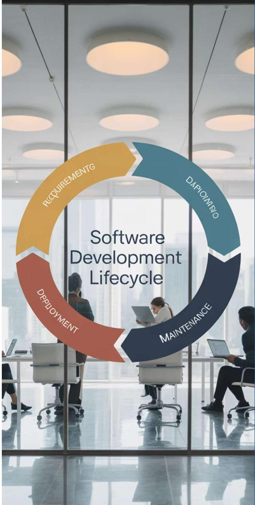

# 시스템 개발 과정의 이해

체계적인 시스템 개발 절차와 생명주기 이해

# 학습 목표 다시 보기

## 소프트웨어 위기
소프트웨어 개발 위기의 배경과 체계적 개발 방법론의 필요성 이해

## SDLC 모형
시스템 개발 생명 주기의 단계별 특징과 프로토타입 모형 적용 방법

## 프로젝트 관리
일정, 범위, 비용, 품질, 위험 관리 등 프로젝트 관리 요소 학습

## 소프트웨어 공학
품질, 비용, 일정 준수를 위한 소프트웨어 공학의 계층 구조와 접근법

## 정보시스템 유형
TPS, MIS, DSS 등 다양한 정보시스템의 특징과 적용 환경 파악

## 시스템 개발 참여자
시스템 분석가, 개발자, 이해관계자 간의 역할과 협업 방식 이해

# 문제 정의 및 프로젝트 기획

프로젝트의 성공을 위한 첫 단계

프로젝트의 제약조건 및 가정조건

## 제약조건

- (시간) 프로젝트 완료 기한, 중간 마일스톤 기한 등
- (비용) 예산 제한, 추가 자금 확보의 어려움 등
- (리소스) 사용 가능한 인력, 장비, 소프트웨어, 기타 자원의 제한
- (범위) 프로젝트 범위, 옵션, 방향 등을 제한하는 요인
- (기술) 현재 사용할 수 있는 기술이나 기술적 능력의 제한

## 가정조건

- (리소스 가용성) 필요한 인력과 장비가 사용 가능할 것이라는 가정
- (참여자의 참여) 핵심참여자, 이해관계자가 적극적으로 참여할 것이라는 가정
- (외부 요인) 경제적 상황, 시장의 반응, 경쟁사의 움직임에 대한 가정
- 기술적 성공: 새로운 기술이나 방법론이 예상대로 작동할 것이라는 가정
- 의존성: 작업이나 모듈 간의 순서와 연관성에 대한 가정

# 프로젝트 목표 수립 프로세스

- 우리가 달성하고자 하는 결과를 측정 가능하고 최적화할 수 있는 목표로 바꾸는 과정
- 조직이 목표와 우선순위를 달성하기 위해 취할 수 있는 조치의 종류를 명확화
- 데이터 분석 관점에서 접근: 어떤 데이터가 있고, 어떤 데이터가 더 필요한가? (외부, 공용 데이터 등)
- 어떤 분석을 수행해야 하는가? (설명, 이벤트 감지, 예측, 최적화, 행동 변화 유도)

자료: http://www.datasciencepublicpolicy.org/home/resources/data-science-project-scoping-guide/

# 소프트웨어 공학에 대한 이해

> "소프트웨어 위기는 1960년대 후반부터 발생한 소프트웨어 개발 문제를 지칭하며, 체계적인 방법론 없이는 프로젝트가 종종 실패로 이어집니다."

소프트웨어 위기는 복잡하고 대규모 시스템 개발 시 체계적인 방법론의 부재로 인해 발생하는 다양한 문제점들을 의미합니다. 이러한 위기 상황은 소프트웨어 공학이라는 학문 분야의 탄생 배경이 되었습니다.

- 개발 기간 지연
- 품질 저하
- 유지보수 어려움
- 예산 초과
- 사용자 요구사항 불충족
- 프로젝트 실패율 증가

# 소프트웨어 공학의 출현과 목표

- 소프트웨어 위기를 해결하기 위해 소프트웨어 공학이라는 개념이 등장했습니다.
- IEEE의 소프트웨어 공학 정의: 품질이 좋은 소프트웨어를 최소한의 비용으로 계획된 일정에 맞추어 개발하는 것
- 소프트웨어 공학의 주요 목표:
- 품질 향상 – 체계적인 방법으로 소프트웨어 결함을 줄이고 사용자 요구사항을 충족하는 제품 개발
- 비용 절감 – 효율적인 개발 프로세스를 통해 개발 및 유지보수 비용 최소화
- 일정 준수 – 계획된 일정에 맞추어 예측 가능한 방식으로 소프트웨어 개발 완료
- 소프트웨어 공학은 소프트웨어의 개발, 운용, 유지보수 및 파기에 대한 체계적인 접근 방법을 제공합니다.

# 소프트웨어 공학의 계층구조 1

## 도구 (Tools)
프로그램 개발 과정에서 사용되는 방법을 자동화한 것
CASE(Computer-Aided Software Engineering)는 소프트웨어 개발 전 단계를 지원하는 대표적 도구
개발 생산성 향상과 품질 개선에 기여

## 품질 (Quality)
소프트웨어의 평가 기준
- 정확성 (Correctness): 요구사항에 맞게 동작하는 정도
- 유지보수성 (Maintainability): 변경 및 보수가 용이한 정도
- 무결성 (Integrity): 데이터와 시스템의 안전성과 보안성
- 사용성 (Usability): 사용자가 쉽게 배우고 사용할 수 있는 정도

# 소프트웨어 공학의 계층구조 2

# 방법론(자료중심, 객체지향, 프로세스 중심) 비교

|  방법론 | 자료 중심 방법론 | 객체지향 방법론 | 프로세스 중심 방법론  |
| --- | --- | --- | --- |
|  개념 | 데이터 구조 중심 | 객체 모델링 중심 | 프로세스 흐름 중심  |
|  등장 시기 | 1970년대 중반 | 1980년대 후반 | 1970년대 초반  |
|  핵심 특징 | 자료와 자료 간의 관계 분석 후 자료 구조 정의 및 쿼리 중심 | 객체 캡슐화, 정보 은닉, 상속, 다형 성, 코드 재사용성 향상 | 자료의 변환과정과 프로세스를 강조 하여 프로그램 개발  |
|  모델링 도구 | ERD (Entity-Relationship Diagram) | UML (Unified Modeling Language) | DFD (Data Flow Diagram)  |
|  대표적 기법 | IE, IM, OMT | RUP, Booch, OMT | SADT, Yourdon, Gane-Sarson  |
|  주요 장점 | 데이터베이스 설계에 적합, 안정적 데이터 구조 | 유지보수 용이, 재사용성, 복잡한 시 스템에 적합 | 직관적 이해, 시스템 기능 파악 용이  |

## 방법론의 진화 방향

프로세스 중심(1970년대) → 자료 중심(1970년대 중반) → 객체지향(1980년대 후반) → 통합 방법론

현대적 시스템 개발은 객체지향과 다른 방법론의 장점을 결합한 통합적 접근 방식을 주로 활용합니다.

> ###  소프트웨어 공학 방법론의 계층 구조: 도구, 품질, 방법론, 프로세스

  

# 소프트웨어 공학의 계층구조 3 : 개발 프로세스

## 소프트웨어 명세
요구사항 수집 및 분석을 통한 시스템 기능 정의

## 소프트웨어 개발
설계, 구현, 테스트를 통한 소프트웨어 제작

## 소프트웨어 검증
요구사항 충족 여부 및 품질 확인

## 소프트웨어 진화
운영 및 유지보수를 통한 지속적 개선

## 소프트웨어 개발 프로세스 단계별 작업 및 산출물

|  프로세스 단계 | 주요 활동 | 산출물  |
| --- | --- | --- |
|  소프트웨어 명세 | - 고객 인터뷰 및 요구사항 수집  - 기능적/비기능적 요구사항 분석  - 사용자 스토리 및 유스케이스 작성 | - 요구사항 명세서 - 사용자 스토리  - 시스템 범위 문서  |
|  소프트웨어 개발 | - 소프트웨어 설계(아키텍처, DB 등) - 코딩 및 구현 - 단위 테스트 및 통합 | - 설계 문서 - 프로그램 소스 코드 - 테스트 케이스  |
|  소프트웨어 검증 | - 테스팅(기능, 성능, 통합) - 품질 보증 - 결함 식별 및 수정 | - 테스트 결과 보고서 - 결함 목록 - 검증 승인 문서  |
|  소프트웨어 진화 | - 유지보수(수정, 적응, 완전화, 예방) - 지속적 개선 - 변화 관리 | - 변경 요청서 - 업데이트된 문서 - 릴리즈 노트  |

  

<b>시스템과 시스템 개발자</b> 
<b>정보시스템의 개념과 개발에 참여하는 사람들의 역할</b>

# 시스템의 개념과 정의

## 시스템의 정의
시스템은 특정 목적을 달성하기 위해 상호작용하는 구성요소들의 집합으로, 정보시스템은 데이터를 수집, 처리, 저장, 분석하여 의사결정에 필요한 정보를 제공합니다.

## 정보시스템의 목적
비즈니스 운영 지원, 의사결정 최적화, 경쟁 우위 확보를 통해 조직의 효율성과 생산성을 향상시킵니다.

## 정보시스템 구조
하드웨어, 소프트웨어, 데이터, 프로세스, 사용자가 유기적으로 결합되어 원활한 정보 흐름을 가능하게 합니다.

## 데이터 처리를 통한 가치 창출
단순 데이터를 의미 있는 정보로 변환하여 조직이 시장 변화에 신속하게 대응하고 비즈니스 기회를 포착할 수 있도록 지원합니다.

# 시스템 개발 참여자

| 역할 | 주요 업무 | 기술/역량 | 프로젝트 단계 |
|---|---|---|---|
| **사용자 (End-User)** | 시스템을 실제로 사용하는 주체 요구사항 제공 및 피드백 사용자 수용 테스트 참여 | 업무 도메인 지식 변화 수용성 요구사항 표현 능력 | 요구사항 수집 프로토타입 검증 사용자 테스트 |
| **시스템 분석가 (Systems Analyst)** | 사용자 요구사항 분석 시스템 설계 및 명세 비즈니스–IT 연계 | 분석적 사고력 의사소통 능력 모델링 기법 | 요구분석 설계 문서화 |
| **프로그래머 (Programmer)** | 설계에 따른 코드 작성 단위 테스트 수행 기술적 문제 해결 | 프로그래밍 언어 알고리즘 개발 디버깅 능력 | 구현 코딩 테스트 |
| **프로젝트 관리자 (Project Manager)** | 프로젝트 계획 및 관리 자원 배분 및 일정 조정 위험 관리 및 팀 조정 | 리더십 일정/비용 관리 문제 해결 능력 | 프로젝트 전체 계획–실행–통제 종료 및 평가 |
| **의뢰인 (Client)** | 시스템 개발 요청 프로젝트 비용 지불 최종 승인 결정 | 비즈니스 이해 의사결정 능력 투자 판단력 | 초기 요청 중간 리뷰 최종 인수 |

시스템 개발은 모든 참여자의 긴밀한 협업을 통해 성공적으로 완수됩니다.

# 시스템 분석가의 역할

- 컨설턴트: 사용자와 경영진에게 새로운 기술과 시스템에 대한 조언 제공, 비즈니스 프로세스 개선 방안 제시
- 지원 전문가: 기술적 문제 해결과 시스템 구현 지원, 사용자 교육 및 기술 가이드 제공
- 변화 관리자: 조직 내 변화를 촉진하고 새로운 시스템 도입 관리, 저항 최소화와 수용도 증대
- 문제 해결사: 비즈니스 문제를 파악하고 기술적 해결책 제시, 복잡한 문제를 체계적으로 분석하고 해결

시스템 개발은 모든 참여자의 긴밀한 협업을 통해 성공적으로 완수됩니다.

## 시스템 분석가의 자질과 역량

## 문제 해결력
복잡한 비즈니스 문제를 분석하고 효과적인 시스템 기반 해결책을 제시할 수 있는 논리적 사고 능력과 창의성

## 의사소통 능력
다양한 이해관계자(경영진, 개발자, 사용자)와 효과적으로 소통하며 기술적 개념을 비기술적 용어로 설명하는 능력

## 윤리성
데이터 보안, 개인정보 보호, 사회적 영향을 고려한 의사결정과 프로페셔널리즘을 실천하는 책임감

## 협업 리더십
프로젝트 팀을 효과적으로 이끌고 다양한 전문가들과 협력하여 공통 목표를 달성하는 능력

<b>시스템 개발 생명주기 (SDLC)</b> 
<b>체계적인 소프트웨어 개발의 순환 과정과 단계별 활동</b>

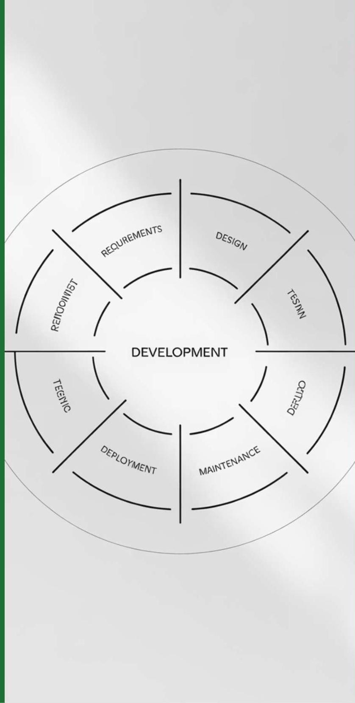

# SDLC 단계 1: 문제/기회/목표 식별

## 문제 인식
현재 시스템의 비효율성이나 한계점을 파악하고 명확히 정의

## 기회 발견
시스템 개선을 통해 얻을 수 있는 비즈니스 기회와 이점 식별 목표 설정: 새로운 시스템이 달성해야 할 구체적이고 측정 가능한 목표 수립

## 이해관계자 분석
프로젝트에 영향을 주고받는 모든 관련자 식별 및 요구사항 초기 수집 범위 정의: 프로젝트의 경계와 제약사항을 명확히 설정하여 향후 단계의 기초 마련

# SDLC 단계 2: 요구 파악

## 이해관계자 인터뷰

시스템의 직접적/간접적 이용자, 의사결정자, 경영진 등 다양한 관점 수집

- 구조적 인터뷰: 미리 준비된 질문으로 일관된 정보 수집
- 그룹 인터뷰(JAD): 협업적 요구사항 도출로 시간 단축

## SWOT 분석

현재 시스템이나 비즈니스 상황의 종합적 평가

- 강점(Strengths)과 약점(Weaknesses): 내부적 요인 분석
- 기회(Opportunities)와 위협(Threats): 외부 환경 분석

## 요구사항 문서화

수집된 정보를 체계적으로 정리하여 명확한 시스템 요구사항 정의

- 기능적 요구사항: 시스템이 수행해야 할 기능
- 비기능적 요구사항: 성능, 보안, 사용성 등 품질 속성

## 요구사항 수집 기법

- 인터뷰
- 설문조사
- 관찰
- 문서 분석
- 워크샵
- 프로토타이핑

# SDLC 단계 3: 분석

## 문제 정의
비즈니스 문제를 명확하게 식별하고 분석 범위를 설정합니다. 이 단계에서는 현재 시스템의 문제점을 상세히 파악하고 해결책을 위한 기초를 마련합니다.

## 프로세스 흐름
현행 업무 프로세스를 파악하고 새로운 시스템에 적용할 업무 흐름을 모델링합니다. 비즈니스 로직과 업무 규칙을 명확히 정의하여 시스템의 기능적 요구사항을 구체화합니다.

## 데이터 흐름도(DFD)
시스템 내부의 데이터 흐름을 시각적으로 표현하는 도구로, 프로세스 간의 데이터 이동과 저장소를 명확하게 보여줍니다. 사용자와 개발자 간의 효과적인 의사소통 도구로 활용됩니다.

# SDLC 단계 4: 설계

## 시스템 아키텍처 설계

소프트웨어의 전체적인 구조와 컴포넌트 간의 관계를 정의하며, 하드웨어/소프트웨어 요구사항, 모듈 분해, 논리적 구조화를 포함

## 사용자 인터페이스 설계(UI/UX)

사용자 친화적이고 효율적인 화면 설계, 대화상자, 메뉴, 내비게이션 구조 등을 통해 사용자 경험을 최적화

## 데이터베이스 설계

ERD(Entity-Relationship Diagram)
작성, 데이터 모델링, 정규화, 무결성 제약 조건 정의 등을 통해 효율적인 데이터 구조 확립

## 상세 설계 산출물

클래스 다이어그램, 시퀀스 다이어그램, 상태 전이도, 컴포넌트 명세서 등 구현 단계의 기초가 되는 세부 설계 문서화

# SDLC 단계 5: 개발/프로토타입

## 코딩 및 구현
설계 문서에 따라 프로그래밍 언어, 데이터베이스, API 등을 활용해 실제 시스템 구현

## 프로토타이핑
실제 개발 전 사용자 피드백을 위한 시제품 제작
- 수직적 프로토타입: 특정 기능을 깊이 있게 구현
- 수평적 프로토타입: 시스템의 전반적인 기능을 간략히 구현

## 단위 테스트
개별 모듈이나 컴포넌트 단위의 기능 검증 및 버그 식별

## 피드백 수집 및 반영
초기 사용자 테스트를 통한 개선점 도출 및 설계 변경

# SDLC 단계 6: 테스트 및 검증

## 기능 테스트 (Functional Testing)

요구사항 명세서에 기술된 모든 기능이 정확하게 구현되었는지 확인하며, 단위 테스트, 통합 테스트, 시스템 테스트 등의 단계로 진행

## 비기능 테스트 (Non-functional Testing)

성능, 보안, 사용성, 신뢰성, 확장성 등 시스템의 품질 특성을 검증하는 테스트로, 시스템의 안정성과 사용자 경험을 보장

## 사용자 수용시험 (UAT)

최종 사용자가 실제 업무 환경에서 시스템을 테스트하여 업무 요구사항을 충족하는지 확인하는 단계로, 시스템 인수 전 마지막 검증 과정

## 결함 관리

테스트 과정에서 발견된 결함을 기록, 추적, 해결하는 프로세스로, 심각도와 우선순위에 따라 체계적으로 관리

단위테스트  
통합테스트  
시스템테스트  
사용자 수용테스트  

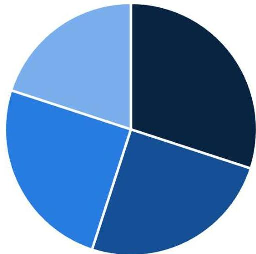

> ### 테스트 단계는 결함 수정 비용이 구현 후보다 10-100배 낮으므로 품질 보증의 핵심

# SDLC 단계 7: 구현 및 운영, 유지보수

## 운영환경 이관
개발된 시스템을 실제 운영환경에 설치하고 배포하는 과정. 사용자 교육, 데이터 마이그레이션, 시스템 문서화를 포함

## 이슈 대응
운영 중 발생하는 오류와 문제를 식별하고 수정하는 활동. 사용자 피드백을 수집하고 버그 수정 및 시스템 안정화 작업 수행

## 지속운영 및 개선
시스템의 성능 모니터링, 정기적인 백업, 보안 업데이트 및 기능 개선을 통해 시스템의 가치를 유지하고 향상시키는 장기적 활동

☐ SDLC 전체 비용의 약 60-80%가 유지보수 단계에서 소요됩니다.

60

# SDLC 단계별 산출물, 유의사항

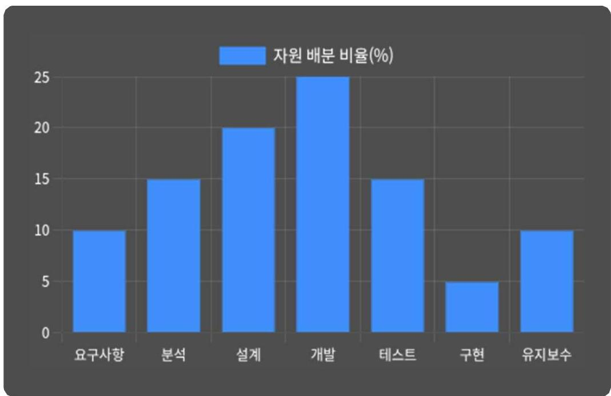

## SDLC 단계별 주요 산출물

|  단계 | 주요 산출물  |
| --- | --- |
|  1. 문제/기회 식별 | 타당성 조사 보고서, 프로젝트 제안서  |
|  2. 요구사항 파악 | 요구사항 명세서, 인터뷰 기록, SWOT 분석  |
|  3. 분석 | 데이터 흐름도(DFD), 프로세스 모델, 사용 사례  |
|  4. 설계 | 야기택처 설계서, 데이터베이스 설계, UI 프로토타입  |
|  5. 개발 | 코드 단위 테스트 결과, 개발자 문서  |

## 단계별 위험 요인 및 고려사항

- 요구사항 불명확성
- 일정 지연
- 범위 확장
- 지원 부족
- 기술적 문제
- 사용자 참여 부족
- 의사소통 문제
- 테스트 불충분

—— 자료: 소프트웨어 공학 기반 시스템 개발 표준 프로세스

# SDLC의 장단점

## 순차적 접근(폭포수) 모델의 강점

### 명확한 단계 구분과 이해도
각 단계가 명확히 구분되어 프로젝트 참여자들이 전체 과정을 쉽게 이해

### 문서화 및 체계적 관리
각 단계별 산출물이 명확하여 프로젝트 진행 상황 추적 용이

## 약점

### 유연성 부족
요구사항 변경 시 이전 단계로 되돌아가기 어려워 변화 대응력이 낮음

### 늦은 결과물 확인
개발 후반부에 실제 결과물을 확인하게 되어 위험 요소 조기 발견이 어려움

## 활용 한계
요구사항이 명확하고 안정적인 프로젝트에 적합하며, 빠른 변화가 필요하거나 불확실성이 높은 환경에서는 애자일 등 다른 방법론 고려 필요

# 프로토타입 개발 방법론

## 프로토타입 모형 특징

사용자 요구사항을 빠르게 반영하여 시제품을 개발하고 사용자 피드백을 통해 반복적으로 개선하는 방법론

## 적용 가능 상황

- 사용자 요구사항이 명확하지 않거나 빈번하게 변경될 가능성이 높은 경우
- 사용자 인터페이스가 중요하고 사용자 경험 이 핵심인 시스템
- 새로운 기술이나 혁신적인 접근이 필요한 프로젝트

## 장단점

### 장점

사용자 참여 증대와 초기 피드백 획득 가능

시스템 이해도 향상과 위험 감소 효과

### 단점

프로젝트 범위 관리가 어렵고 과도한 변경으로 인한 일정 지연 위험

문서화 부족과 프로토타입이 최종 시스템으로 사용되는 오해 발생 가능

> # 애자일 개발 방법론의 이해
> ## 변화에 유연하게 대응하는 시스템 개발 접근법

>> 애자일 방법론은 빠르게 변화하는 비즈니스 환경에서 유연하고 적응적인 개발을 지향합니다. 전통적인 폭포수 모델과 달리 반복적이고 점진적인 개발을 통해 고객 요구사항의 변화에 신속하게 대응할 수 있습니다.

# 애자일 선언문의 핵심 가치

## 프로세스와 도구보다 개인과 상호작용 중시
프로젝트의 성공은 사람과 팀원 간의 효과적인 의사소통에 달려 있습니다. 도구와 프로세스는 이를 지원하는 역할을 합니다.

## 계약 협상보다 고객과의 협력 중시
고객과 개발팀 간의 지속적인 협력을 통해 프로젝트 목표를 더 잘 달성할 수 있습니다. 계약은 협력의 기반이지만 관계가 더 중요합니다.

## 포괄적인 문서보다 작동하는 소프트웨어 중시
가치를 창출하는 것은 실제로 작동하는 소프트웨어입니다. 문서는 필요한 수준에서 작성되어야 하지만 과도한 문서화는 지양합니다.

## 계획을 따르기보다 변화에 대응 중시
초기 계획은 중요하지만, 변화하는 요구사항과 환경에 유연하게 대응하는 능력이 더 가치 있습니다.

> ### 2001년 발표된 애자일 선언문은 소프트웨어 개발의 패러다임 전환을 가져왔으며, 오늘날 대부분의 현대적 개발 방법론의 기초가 되었습니다.

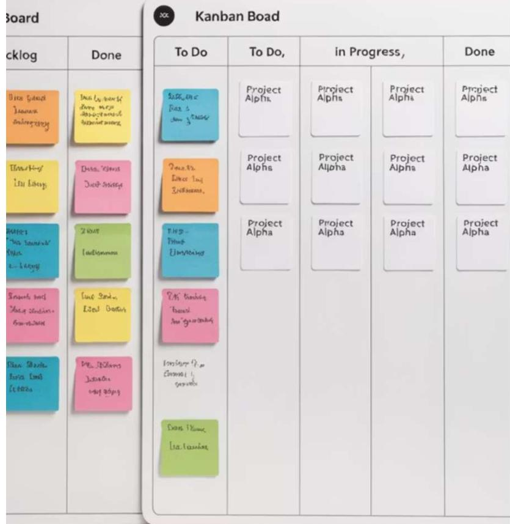

# 애자일 개발 방법론의 주요 프레임워크

## 스크럼 (Scrum)

가장 널리 사용되는 애자일 프레임워크로, 스프린트라 불리는 짧은 개발 주기(보통 2-4 주)를 반복합니다.

- 제품 백로그: 개발해야 할 기능 목록
- 스프린트 계획: 다음 스프린트에서 개발할 항목 선정
- 데일리 스크럼: 15분 내외의 일일 상태 업데이트 회의
- 스프린트 리뷰: 완료된 기능 검토
- 스프린트 회고: 프로세스 개선 논의

## 칸반 (Kanban)

작업 흐름을 시각적으로 관리하는 방식으로, 진행 중인 작업량을 제한하고 연속적인 흐름을 강조합니다.

- 작업 가시화: 보드를 통한 업무 상태 시각화
- 진행 중 작업 제한(WIP): 병목현상 방지
- 흐름 관리: 지속적인 작업 처리
- 명시적 프로세스 정책: 명확한 규칙 설정
- 지속적 개선: 프로세스 피드백 및 개선

# 극단적 프로그래밍(XP)과 특징

XP(eXtreme Programming)는 소프트웨어 품질과 개발팀의 변화 대응력을 높이는 데 중점을 둔 애자일 방법론입니다.

## 페어 프로그래밍
두 명의 개발자가 한 컴퓨터에서 함께 작업하며 코드 품질 향상과 지식 공유를 촉진합니다.

## 지속적인 통합
코드 변경사항을 자주 통합하여 충돌 문제를 줄이고 빠른 피드백을 얻습니다.

## 테스트 주도 개발(TDD)
코드 작성 전에 테스트를 먼저 작성하여 요구사항을 명확히 하고 품질을 보장합니다.

## 리팩토링
기능 변경 없이 코드 구조를 개선하여 유지보수성과 확장성을 높입니다.

## 단순한 설계
현재 요구사항을 충족하는 가장 단순한 솔루션을 지향하고 불필요한 복잡성을 제거합니다.

##### <b>XP는 기술적 우수성과 협업을 강조하며, 빠른 피드백 루프를 통해 고품질 소프트웨어를 지속적으로 제공합니다.</b>

# 애자일과 전통적 방법론 비교

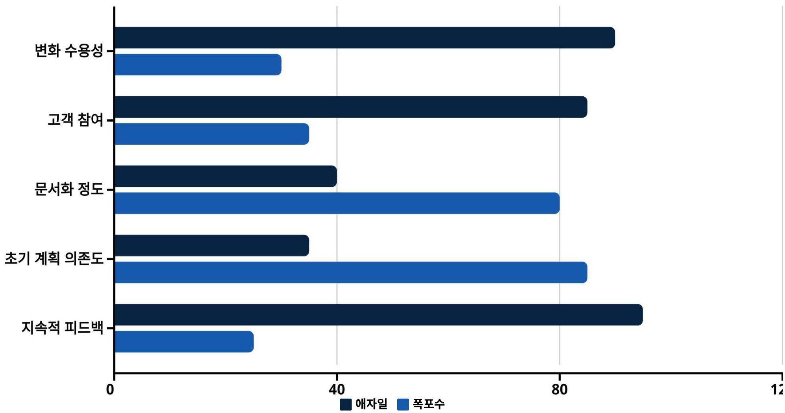

애자일 방법론은 변화에 유연하게 대응하고 고객과의 지속적인 협력을 중시하는 반면, 전통적인 폭포수 모델은 체계적인 문서화와 초기 계획에 의존하는 특성을 보입니다. 프로젝트의 성격과 요구사항의 명확성에 따라 적합한 방법론을 선택하는 것이 중요합니다.

# 애자일 도입 시 고려사항

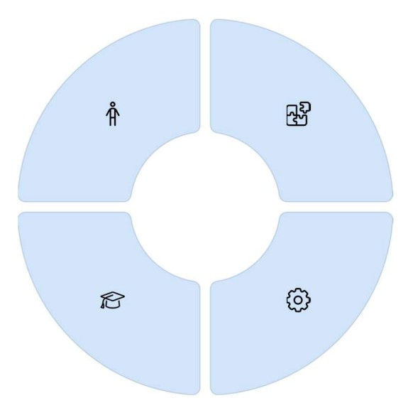

## 조직 문화
애자일은 단순한 방법론이 아닌 문화적 변화를 요구합니다. 자율성, 투명성, 협업을 중시하는 문화가 필요합니다.

## 교육과 코칭
팀원들이 애자일 원칙과 실천 방법을 이해하고 적용할 수 있도록 지속적인 교육과 코칭이 필요합니다.

## 점진적 도입
전체 조직보다는 소규모 팀부터 시작하여 성공 사례를 만들고 점진적으로 확장하는 것이 효과적입니다.

## 적절한 도구
작업 관리, 버전 관리, 자동화 테스트, 지속적 통합 등을 지원하는 도구를 선택하고 활용합니다.

애자일 방법론의 성공적인 도입을 위해서는 기술적 측면뿐만 아니라 조직과 문화적 측면에서의 변화 관리가 중요합니다.

# 애자일과 비즈니스 가치 창출

## 애자일이 비즈니스 가치를 창출하는 방식

- 빠른 시장 출시: 점진적인 개발과 릴리스로 제품을 더 빨리 시장에 선보여 경쟁 우위 확보
- 우선순위 기반 개발: 가장 가치 있는 기능을 먼저 개발하여 투자 대비 수익(ROI) 최적화
- 리스크 감소: 조기 피드백과 지속적인 검증으로 개발 위험 최소화
- 품질 향상: 지속적인 통합과 테스트로 제품 품질 개선
- 고객 만족도 증가: 고객 참여와 피드백 반영으로 사용자 요구에 더 부합하는 제품 개발
- 팀 생산성 향상: 자율적인 팀운영과 장애물 제거로 생산성 증대

 

애자일 방법론은 단순한 개발 프로세스를 넘어 비즈니스 성과와 고객 가치 창출에 직접적으로 기여하는 전략적 접근법입니다.

# 대규모 애자일: SAFe, LeSS, Nexus

대규모 조직에서 애자일을 적용하기 위한 프레임워크들이 발전해왔습니다.

## SAFe (Scaled Agile Frame work)

가장 널리 사용되는 대규모 애자일 프레임워크로, 팀, 프로그램, 포트폴리오 수준의 계층적 구조를 제공합니다. 대기업과 복잡한 프로젝트에 적합하며 세부적인 가이드라인을 제공합니다.

## LeSS (Large Scale Scrum)

스크럼의 원칙과 실천법을 최소한의 오버헤드로 확장한 프레임워크입니다. 여러 팀이 하나의 제품 백로그를 공유하고 동기화된 스프린트로 작업합니다.

## Nexus

스크럼의 창시자 중 한 명인 켄 슈와버가 개발한 프레임워크로, 3-9개 팀의 통합에 초점을 맞춥니다. 통합 팀을 통해 의존성을 관리하고 조정합니다.

# 한국 기업의 애자일 도입 사례

## 네이버

네이버는 2011년부터 스크럼 기반의 애자일 방법론을 도입하여 서비스 개발 프로세스를 혁신했습니다. 2주 단위의 스프린트와 데일리 스크럼 미팅을 통해 빠른 피드백과 지속적인 개선을 실현하고 있습니다. 특히 클라우드 서비스와 AI 플랫폼 개발에 애자일 방식을 적극 활용하여 시장 변화에 신속하게 대응하고 있습니다.

## 삼성SDS

삼성SDS는 대규모 엔터프라이즈 프로젝트에 SAFe(Scaled Agile Framework)를 도입하여 복잡한 시스템 개발의 효율성을 높였습니다. 특히 금융, 제조, 물류 분야의 디지털 트랜스포메이션 프로젝트에서 애자일 방법론을 적용하여 고객 요구사항 변화에 유연하게 대응하고 개발 주기를 단축시켰습니다.

##### 국내 기업들도 글로벌 트렌드에 맞춰 애자일 방법론을 도입하고 있으며, 각 기업의 특성과 문화에 맞게 방법론을 조정하여 적용하고 있습니다.

# 프로젝트 관리자의 역할

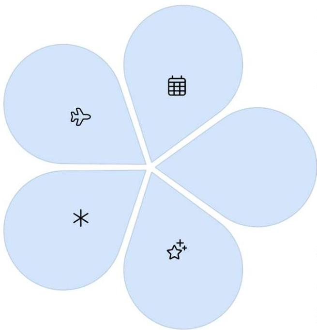

## 계획 관리
프로젝트의 범위, 목표, 필요 자원, 활동 계획 수립 및 이해관계자 관리, 실행 전략 개발

## 위험 관리
잠재적 위험 요소 식별, 대응 전략 수립, 이슈 관리 및 문제 해결, 변경 관리

## 일정 관리
작업 우선순위 설정, 진척도 모니터링, 마일스톤 설정, 일정 준수 관리 및 조정

## 예산/비용 관리
자원 배분, 예산 책정, 비용 모니터링, 재무적 위험 관리, ROI 분석

## 품질 관리
품질 기준 설정, 품질 보증 활동 계획, 결과물 검증 프로세스 설계 및 실행

# 프로젝트 관리 단계별 프로세스

| 01 | 02 | 03 |
|---|---|---|
| **착수 (Initiation)** 프로젝트 타당성 검토 및 사업 기회 평가 프로젝트 헌장(Project Charter) 개발 이해관계자 식별 및 참여 전략 수립 초기 범위 정의 및 고수준 요구사항 수집 | **계획 (Planning)** 상세 프로젝트 관리 계획서 작성 일정·비용·품질 계획 및 기준선 수립 위험 관리 계획 및 주요 리스크 식별 인적 자원 계획 및 의사소통 방법 정의 상세 작업 분류 구조(WBS) 작성 | **실행 (Execution)** 계획에 따른 프로젝트 활동 수행 팀 구성 및 자원 할당 계획된 작업 실행 이해관계자 참여 관리 품질 보증 활동 실행 |
| **04** | **05** |   |
| **감시/통제 (Monitor & Control)** 프로젝트 진행 상황 모니터링 변경 관리 범위·일정·비용 통제 성과 측정 및 보고 위험 관리 및 이슈 해결 | **종료 (Closure)** 프로젝트 완료 및 평가 최종 산출물 인도 및 승인 교훈 문서화 프로젝트 평가 및 성공 측정 자원 해제 및 행정적 종료 |   |

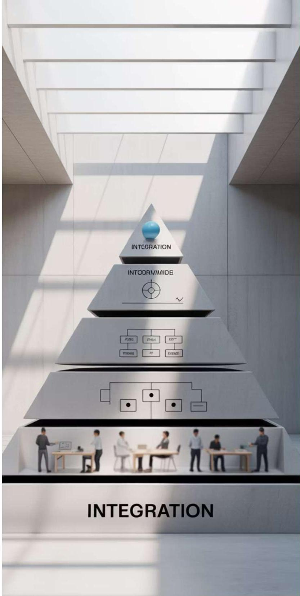

# 정보시스템 분류 개요

조직의 목적과 기능에 따른 정보시스템 유형 이해

# 운영 정보시스템(TPS 등)

거래처리시스템(TPS: Transaction Processing System)은 일상적인 비즈니스 거래와 작업을 처리하는 기본 운영 시스템으로, 조직 운영의 기반이 되는 핵심 데이터를 생성

## 주요 특징

- 대량의 트랜잭션을 빠르고 정확하게 처리하여 현장 업무 자동화
- 실시간 데이터 처리로 즉각적인 정보 제공 및 의사결정 지원
- 다른 정보시스템(MIS, DSS 등)의 기반 데이터 제공

## 대표적인 예시

POS 시스템(판매 시점 관리), 예약 시스템, 은행 ATM, 급여 처리, 재고 관리, 주문 처리 시스템 등 기업의 일상적 운영 업무를 지원하는 필수 시스템

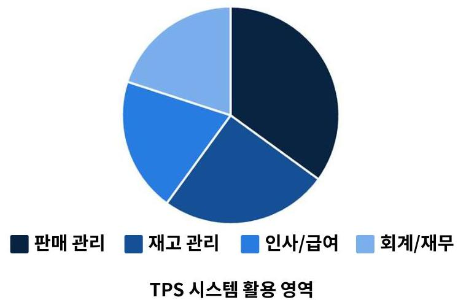

# 지식/사무/관리가치 정보시스템

|  시스템 유형 | 주요 목적 | 특징 | 주요 사용자  |
| --- | --- | --- | --- |
|  사무자동화 시스템OAS (Office Automation System) | 일상적인 사무 업무 처리 자동화 | 문서 작성, 일정 관리, 메일, 자료 공유 등 기본 사무 기능 제공 | 모든 레벨의 사무직 직원  |
|  지식업무 시스템KWS (Knowledge Work System) | 지식 근로자의 생산성 향상 및 지식 창출 지원 | 전문적인 지식 생성, 통합, 공유 도구 제공, 협업 환경 지원 | 엔지니어, 연구원, 디자이너 등 전문직  |
|  경영정보 시스템MIS (Management Information System) | 일상적인 비즈니스 운영 관리 및 의사결정 지원 | 체계적 보고서, 요약 정보, 내부 운영 데이터 분석 제공 | 중간 관리자, 일선 관리자  |
|  의사결정 지원 시스템DSS (Decision Support System) | 반구조적 문제 해결 및 의사결정 지원 | 분석 모델, 시뮬레이션, 대안 평가 도구, 데이터 마이닝 기능 | 중간/고위 관리자, 분석가  |

# 정보시스템 계층구조와 활용 특성

- 조직 계층별 상이한 정보 요구 충족: 운영층(세부 데이터), 관리층(종합 정보), 전략층(전체 요약)
- 정보의 흐름: 하위 시스템에서 수집된 데이터가 상위 시스템의 의사결정에 활용됨
- 현대적 경영환경에서는 시스템 간 통합과 데이터 공유가 경쟁력의 핵심 요소

# 전략/협업 정보시스템

|  전략적 정보시스템 유형 | 특징 | 실제 활용 사례  |
| --- | --- | --- |
|  ESS경영진 지원시스템(Executive Support Systems) | 최고경영자의 전략적 의사결정 지원 | 현대자동차 - ESS실시간 글로벌 판매 현황 및 시장 분석, 전략적 의사결정 지원 대시보드 운영  |
|  GDSS그룹 의사결정 지원시스템(Group Decision Support Systems) | 협업을 통한 의사결정 최적화 | 네이버 - GDSS분산 팀을 위한 협업 의사결정 시스템으로 데이터 기반 제품 개발 의사결정 지원  |
|  ERP전사적 자원관리(Enterprise Resource Planning) | 전체 기업 자원의 통합관리 | 삼성전자 - ERP글로벌 통합 ERP 시스템을 통해 26개국 생산-판매-물류 통합관리, 실시간 원가 모니터링  |
|  CRM고객관계관리(Customer Relationship Management) | 고객 데이터 기반 마케팅 및 서비스 | 신한금융그룹 - CRM통합 고객 데이터 플랫폼으로 고객 세분화 및 맞춤형 금융상품 추천 시스템  |

# 전략/협업 시스템의 핵심 특성

- 기업 전략 및 상위 의사결정 지원
- 데이터 통합 및 단일 정보 소스
- 부서간 협업 및 정보 공유 촉진
- 실시간 비즈니스 모니터링

# 최신 IT 동향과 정보시스템

## 이커머스(E-commerce)

온라인 소매업 성장 가속화, 옴니채널 전략의 확대, 소셜 커머스와 라이브 커머스 등 플랫폼 다양화

## 모바일 기술

모바일 중심 서비스 설계(Mobile-First), 앱 생태계 확장, 업무용 모바일 애플리케이션 증가, 모바일 기반 결제시스템 보편화

## 오픈소스 소프트웨어

기업 환경에서 오픈소스 도입 증가, 협업적 개발 모델 확산, 비용 절감과 커스터마이징 용이성 증대

## 클라우드 컴퓨팅

SaaS, PaaS, IaaS 등 서비스형 모델 확산, 하이브리드 클라우드 솔루션 보편화, 확장성과 비용 효율성 추구

# 시스템 분석 및 설계 필요성과 효과

## 경쟁력 향상

체계적인 시스템 분석 및 설계를 통해 기업은 비즈니스 프로세스를 최적화하고, 시장 변화에 신속하게 대응할 수 있는 유연한 시스템을 구축하여 경쟁 우위 확보

## 효율성 증대

명확한 요구사항 정의와 체계적인 설계로 개발 시간 단축, 자원 낭비 방지, 중복 작업 감소, 그리고 유지보수 비용 절감 효과

## 위험 감소

초기 단계에서의 철저한 분석과 설계를 통해 프로젝트 실패 위험을 최소화하고, 보안 취약점, 통합 문제, 확장성 제약 등 잠재적 위험 요소를 사전에 식별 및 대응

# 요약 및 핵심 개념

## 1
**소프트웨어 공학**
- 소프트웨어 위기 해결을 위한 체계적 접근
- 품질, 비용, 일정을 고려한 개발 방법론
- 프로세스, 방법론, 도구, 품질로 구성된 계층 구조

## 2
**시스템 개발 참여자**
- 사용자, 시스템 분석가, 프로그래머, 프로젝트 관리자
- 시스템 분석가의 다양한 역할과 필요 자질
- 각 참여자 간의 효과적인 의사소통 필요

## 3
**개발 방법론**
- SDLC의 단계적 접근과 장단점
- 프로토타입 모형의 반복적 개발과 빠른 피드백
- 애자일 접근법의 유연성과 변화 수용

## 1
**프로젝트 관리**
- 계획, 일정, 비용, 품질, 위험 관리의 중요성
- 프로젝트 성공을 위한 체계적 관리 필요
- 유지보수의 장기적 영향 이해

## 2
**정보시스템 유형**
- 운영, 지식, 관리, 전략적 수준의 다양한 시스템
- 각 시스템의 목적과 사용자 특성 이해
- 새로운 기술 통합을 통한 시스템 발전

# 향후 학습 방향

시스템 분석 및 설계의 기초를 배웠습니다. 앞으로 학습할 내용들은 다음과 같습니다:

|  |   |   |
| --- | --- | --- |

요구사항 수집 및 분석 심화

효과적인 인터뷰 기법, 요구사항 명세서 작성, 요구사항 우선순위 지정

시스템 모델링 기법

프로세스 모델링, 데이터 모델링, 객체 모델링 방법론 및 도구

시스템 설계 상세화

아키텍처 설계, 인터페이스 설계, 데이터베이스 설계, 보안 설계

이어지는 강의에서는 이러한 개념들을 더 깊이 탐구하고, 실제 프로젝트에 적용하는 방법을 배우게 될 것입니다. 특히 요구사항 분석과 설계 단계에서 실습을 통해 실무 역량을 강화할 예정입니다.

81

# 토론 및 질문

오늘 배운 내용에 대해 생각해보고 다음 질문들에 대해 고민해 봅시다:

- 소프트웨어 위기의 원인은 무엇이며, 소프트웨어 공학은 이를 어떻게 해결하려고 했나요?
- SDLC와 프로토타입 모형 중 어떤 개발 방법론이 어떤 상황에 더 적합할까요?
- 시스템 분석가가 갖추어야 할 가장 중요한 자질은 무엇이라고 생각하나요?

- 시스템 유지보수에 많은 자원이 소요되는 이유는 무엇이며, 이를 줄이기 위한 방법은 무엇일까요?
- 애자일 방법론이 전통적인 SDLC보다 더 효과적일 수 있는 프로젝트 유형은 무엇인가요?

다음 수업 전까지 이러한 질문들에 대해 생각해보고, 수업 중 토론할 준비를 해오시기 바랍니다.

COUNTY OF ORANGE CALIFORNIA

# THANK YOU
